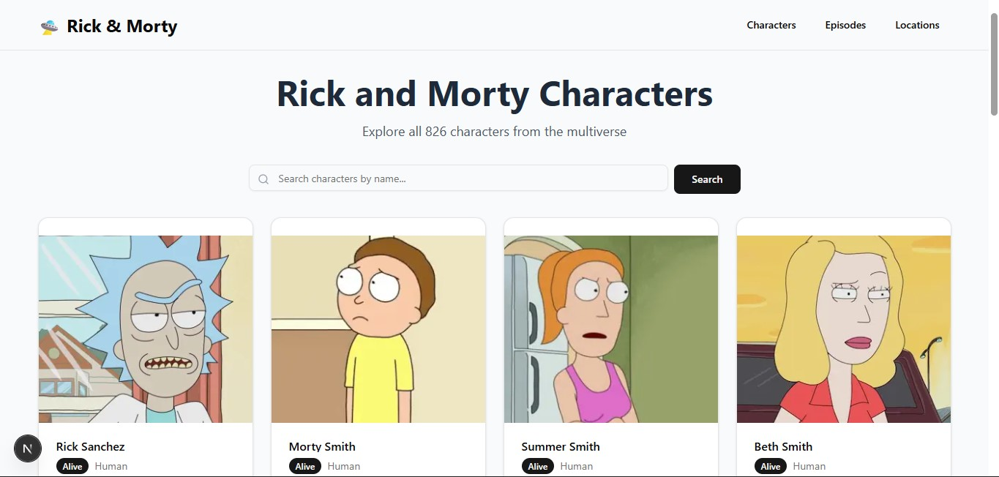
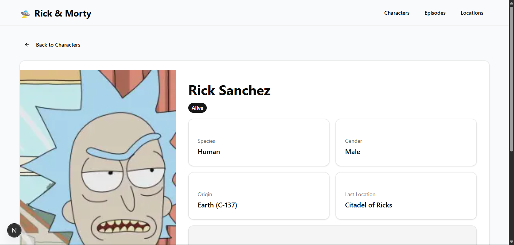
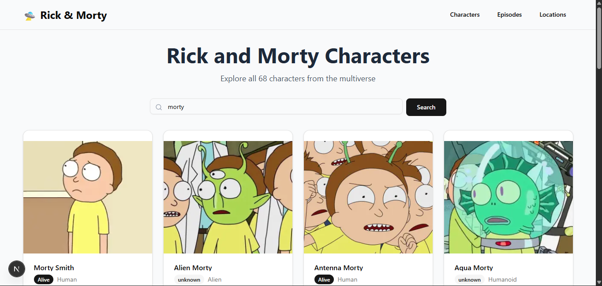

# 🛸 Rick and Morty Explorer

<div align="center">


A modern, responsive web application to explore the Rick and Morty universe. Browse through 800+ characters, episodes, and locations with beautiful UI and smooth interactions.

[Live Demo](https://portal-gun-explorer.vercel.app/) • [Report Bug](https://github.com/veritriariyanto/portal-gun-explorer/issues) • [Request Feature](https://github.com/veritriariyanto/portal-gun-explorer/issues)

</div>

---

## ✨ Features

### 🎯 Core Features
- **🔍 Character Search** - Find your favorite characters by name with instant results
- **📄 Smart Pagination** - Navigate through 800+ characters smoothly
- **🎨 Modern UI Design** - Beautiful interface built with shadcn/ui components
- **📱 Fully Responsive** - Perfect experience on desktop, tablet, and mobile
- **⚡ Lightning Fast** - Optimized with Next.js 15 App Router and Server Components
- **🎭 Detailed Profiles** - View comprehensive information for each character

### 📺 Additional Features
- **Episodes Browser** - Explore all Rick and Morty episodes
- **Locations Database** - Discover locations across the multiverse
- **Status Indicators** - Color-coded badges for character status (Alive, Dead, Unknown)
- **Image Optimization** - Fast loading images with Next.js Image component
- **Error Handling** - Graceful error states with user-friendly messages

---

## 🎬 Demo

### Homepage


### Character Detail


### Search Feature


> **Note:** Add your actual screenshots in `public/screenshots/` folder

---

## 🛠️ Tech Stack

### Frontend Framework
- **[Next.js 15](https://nextjs.org/)** - React framework with App Router
- **[React 18](https://react.dev/)** - UI library
- **[JavaScript](https://developer.mozilla.org/en-US/docs/Web/JavaScript)** - Programming language

### Styling & UI
- **[Tailwind CSS](https://tailwindcss.com/)** - Utility-first CSS framework
- **[shadcn/ui](https://ui.shadcn.com/)** - Re-usable component library
- **[Lucide React](https://lucide.dev/)** - Beautiful icon library

### API & Data
- **[Rick and Morty API](https://rickandmortyapi.com/)** - RESTful API for data
- **Native Fetch API** - Data fetching with error handling

### Development Tools
- **ESLint** - Code linting
- **Git** - Version control

---

## 🚀 Getting Started

### Prerequisites

Before you begin, ensure you have the following installed:
- **Node.js** (version 18.17 or higher)
- **npm**, **yarn**, or **pnpm** (package manager)
- **Git** (for cloning the repository)

Check your Node.js version:
```bash
node --version
```

### Installation

1. **Clone the repository**
```bash
git clone https://github.com/yourusername/rick-morty-nextjs.git
cd rick-morty-nextjs
```

2. **Install dependencies**
```bash
npm install
# or
yarn install
# or
pnpm install
```

3. **Create environment variables**

Create a `.env.local` file in the root directory:
```env
NEXT_PUBLIC_API_URL=https://rickandmortyapi.com/api
NEXT_PUBLIC_API_TIMEOUT=10000
```

4. **Run the development server**
```bash
npm run dev
# or
yarn dev
# or
pnpm dev
```

5. **Open your browser**

Navigate to [http://localhost:3000](http://localhost:3000)

---

## 📁 Project Structure

```
rick-morty-app/
├── app/                      # Next.js App Router
│   ├── layout.js            # Root layout
│   ├── page.js              # Homepage (character list)
│   ├── globals.css          # Global styles
│   ├── characters/          # Character routes
│   │   └── [id]/
│   │       └── page.js      # Character detail page
│   ├── episodes/
│   │   └── page.js          # Episodes page
│   └── locations/
│       └── page.js          # Locations page
│
├── components/              # React components
│   ├── ui/                  # shadcn/ui components
│   │   ├── CharacterCard.js # Character card component
│   │   ├── SearchBar.js     # Search input component
│   │   ├── Pagination.js    # Pagination component
│   │   ├── button.jsx       # shadcn button
│   │   ├── card.jsx         # shadcn card
│   │   ├── badge.jsx        # shadcn badge
│   │   └── input.jsx        # shadcn input
│   └── layout/              # Layout components
│       ├── Header.js        # Navigation header
│       └── Footer.js        # Footer component
│
├── lib/                     # Utility functions
│   └── api.js              # API fetching utilities
│
├── services/                # API service layer
│   ├── characterService.js # Character API calls
│   ├── episodeService.js   # Episode API calls
│   └── locationService.js  # Location API calls
│
├── public/                  # Static assets
│   ├── images/
│   └── screenshots/
│
├── .env.local              # Environment variables (create this)
├── .env.example            # Environment template
├── .gitignore              # Git ignore file
├── next.config.js          # Next.js configuration
├── tailwind.config.js      # Tailwind CSS configuration
├── components.json         # shadcn/ui configuration
├── package.json            # Dependencies
└── README.md               # You are here!
```

---

## 🎯 Key Features Explained

### Server Components
Pages like the homepage and detail pages use **Next.js Server Components** for optimal performance:
- Data fetched on the server
- Reduced JavaScript sent to client
- Better SEO and initial load time

### Client Components
Interactive features like search and pagination use **Client Components**:
- Real-time user interactions
- State management with React hooks
- Smooth transitions and animations

### API Integration
Structured service layer for clean API calls:
```javascript
// Example: services/characterService.js
export async function getAllCharacters(page = 1) {
  const data = await get(`/character?page=${page}`);
  return data;
}
```

### Error Handling
Comprehensive error handling throughout the app:
- Try-catch blocks for all API calls
- User-friendly error messages
- Graceful fallbacks

---

## 🎨 Customization

### Change Theme Colors

Edit `app/globals.css` to customize the color scheme:

```css
@layer base {
  :root {
    --primary: 142 76% 36%;        /* Change primary color */
    --secondary: 210 40% 96.1%;    /* Change secondary color */
    /* Add more custom colors */
  }
}
```

### Add More Components

Install additional shadcn/ui components:

```bash
npx shadcn@latest add dialog
npx shadcn@latest add dropdown-menu
npx shadcn@latest add toast
```

Browse all components: [shadcn/ui Components](https://ui.shadcn.com/docs/components)

---

## 🚢 Deployment

### Deploy to Vercel (Recommended)

1. **Push your code to GitHub**

2. **Import to Vercel**
   - Go to [vercel.com](https://vercel.com)
   - Click "New Project"
   - Import your GitHub repository
   - Vercel will auto-detect Next.js

3. **Add Environment Variables**
   - In Vercel dashboard, go to Settings > Environment Variables
   - Add `NEXT_PUBLIC_API_URL`

4. **Deploy!**
   - Vercel will automatically deploy your app
   - You'll get a live URL


## 🐛 Bug Reports & Feature Requests

Found a bug or have a feature idea? Please open an issue:

- [Report a Bug](https://github.com/veritriariyanto/portal-gun-explorer/issues/new?labels=bug)
- [Request a Feature](https://github.com/veritriariyanto/portal-gun-explorer/issues/new?labels=enhancement)

---

## 📝 License

This project is licensed under the **MIT License** - see the [LICENSE](LICENSE) file for details.

---
